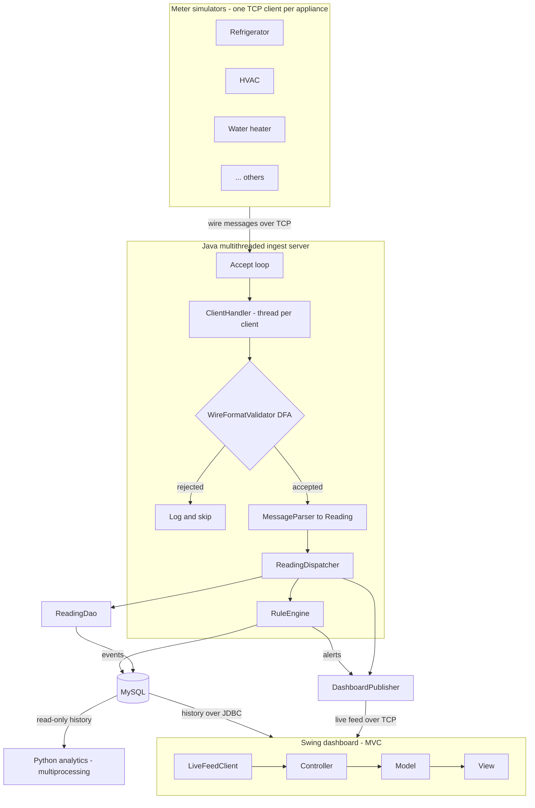
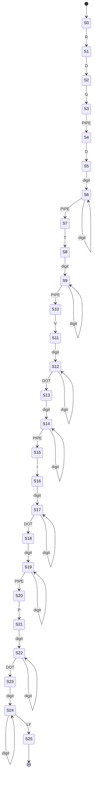

# Smart Home Energy Monitor

A monitoring system that ingests live power readings from simulated smart meters, one
per household appliance, persists them, evaluates them for power-quality problems in real
time, and presents both the live stream and historical trends to an operator. A separate
Python module mines the accumulated history for peak-hour demand and per-device usage
trends.

This repository is the course project for **Advanced Programming Practice (APP)**. The
system is deliberately built to exercise, in one coherent application, all five
programming paradigms surveyed across the five units of the syllabus.

---

## Table of contents

1. [Course context and syllabus mapping](#course-context-and-syllabus-mapping)
2. [The problem this system solves](#the-problem-this-system-solves)
3. [Architecture](#architecture)
4. [Wire protocol and DFA validation](#wire-protocol-and-dfa-validation)
5. [Database schema](#database-schema)
6. [Rule engine detection logic](#rule-engine-detection-logic)
7. [Python analytics module](#python-analytics-module)
8. [Build and run](#build-and-run)
9. [Directory layout](#directory-layout)
10. [Milestones](#milestones)
11. [Team and ownership](#team-and-ownership)
12. [License](#license)

---

## Course context and syllabus mapping

- **Course:** Advanced Programming Practice (APP), 4 credits, 3rd semester
- **Programme:** B.Tech CSE (Software Engineering), SRMIST Kattankulathur, batch 2025–2029
- **Assessment:** 60% project, 20% report and viva; no final written exam (CLA-2 rubric,
  grading up to the Analyze/Evaluate level)

The course surveys five programming paradigms, one per unit. The project touches all five;
each unit maps to a concrete, self-contained component of this system:

| Unit | Syllabus topic | Component in this system |
| ---- | -------------- | ------------------------ |
| I | Java OOP fundamentals (classes, interfaces, threading) | The domain model (`model`), the multithreaded thread-per-client ingest server (`server`), the meter simulators (`simulator`), and the strategy-based rule engine (`rules`). |
| II | GUI programming with Swing/AWT | The dashboard (`client`), structured as Model–View–Controller, showing live per-appliance usage and history. |
| III | Database connectivity via JDBC | The persistence layer (`db`): a connection factory plus one DAO per table over MySQL. |
| IV | Python scripting and multiprocessing | The analytics satellite (`python/analytics`), which parallelises per-device trend analysis across a process pool. |
| V | Formal language / automata | The `WireFormatValidator` (`protocol`): a deterministic finite automaton that validates every meter message before it is parsed. |

The viva is design-justification heavy, so the rationale behind the non-obvious choices is
documented separately in [`docs/DESIGN.md`](docs/DESIGN.md).

---

## The problem this system solves

Household electricity supply is not perfectly clean, and household loads are not perfectly
behaved. Voltage can rise above safe levels (a **spike**) or drop below them (a **sag**),
and an individual appliance can draw more power than its circuit is rated for (an
**overload**). Any of these can damage equipment or indicate a fault, but they are
invisible to a resident who only sees a monthly aggregate bill.

This system makes per-appliance electrical behaviour observable as it happens. Each
appliance has a smart meter that streams voltage, current, and power readings. The server
ingests every stream concurrently, records it, and checks each reading against configured
limits, raising a persisted alert the moment a limit is crossed. An operator watching the
dashboard sees each appliance's live usage, its recent history, and a running log of
alerts. Offline, the Python module answers the longer-horizon questions — when the home
peaks, and how each device's consumption is trending — that support load shifting and fault
diagnosis.

Because real smart-meter hardware is out of scope for a course project, the meters are
simulated: one TCP client process per appliance, generating realistic readings (with
occasional injected anomalies so the detection path can be demonstrated).

---

## Architecture

The system is four cooperating processes (or process groups): the meter simulators, the
Java server, the Swing dashboard, and the Python analytics job. They communicate over TCP
and through the shared MySQL database.



Data flow from meter to dashboard, step by step:

1. A **meter simulator** formats a reading into the wire format and writes it to its TCP
   connection.
2. The server's **accept loop** (`EnergyMonitorServer`) has already handed that connection
   to a dedicated **`ClientHandler`** thread — one thread per connected meter.
3. The handler reads a line and passes it to the **`WireFormatValidator`** DFA. Malformed
   lines are logged and skipped; the connection stays open.
4. An accepted line is turned into a typed `Reading` by **`MessageParser`**.
5. The handler hands the reading to the **`ReadingDispatcher`**, which fans it out to three
   consumers without the handler needing to know about any of them:
   - **`ReadingDao`** persists it to MySQL.
   - the **`RuleEngine`** evaluates it for power-quality events (off the socket read path).
   - the **`DashboardPublisher`** pushes it to any subscribed dashboards.
6. Any `Event` the rule engine raises is persisted through `EventDao` and forwarded to the
   dashboard's alert channel.
7. The **dashboard** shows the live stream (from the publisher over TCP) alongside history
   and past alerts (queried from MySQL over JDBC).
8. Independently, the **Python analytics** job reads the accumulated history from MySQL and
   produces its report.

The rationale for the key structural decisions — TCP vs UDP, thread-per-client vs a pool,
MySQL vs flat files, and keeping the rule engine off the ingest path — is in
[`docs/DESIGN.md`](docs/DESIGN.md).

---

## Wire protocol and DFA validation

### Message format

Meters and server speak a line-oriented text protocol. One reading is one line, terminated
by a newline (`\n`). A line has a fixed `RDG` header followed by five tagged, pipe-delimited
fields, in a fixed order:

```
RDG|D<deviceId>|T<epochMillis>|V<voltage>|I<current>|P<power>\n
```

| Token | Tag | Type | Meaning |
| ----- | --- | ---- | ------- |
| `RDG` | — | literal header | marks the start of a reading frame |
| `D`   | `D` | unsigned integer | device id (foreign key to `devices`) |
| `T`   | `T` | unsigned integer | meter-side timestamp, epoch milliseconds |
| `V`   | `V` | decimal (`digits.digits`) | RMS voltage, volts |
| `I`   | `I` | decimal (`digits.digits`) | RMS current, amperes |
| `P`   | `P` | decimal (`digits.digits`) | real power, watts |

Example of a well-formed line:

```
RDG|D3|T1721817600000|V228.40|I4.10|P998.20
```

The single source of truth for the delimiter, tags, header, and terminator is
`protocol.MeterMessage`, referenced by both the simulator (which formats) and the
validator/parser (which read), so producer and consumer cannot drift apart.

### The validating DFA

Because the format is a regular language, it is validated by a **deterministic finite
automaton** (`protocol.WireFormatValidator`) before any field is parsed. The automaton
consumes the line one character at a time; it accepts only if the entire line matches the
grammar, and it drops to a non-accepting dead (trap) state on the first character that does
not fit. Validation is therefore single-pass, O(n) in the line length, with O(1) memory —
and malformed input never reaches the numeric parsing code.

Input tokens used below: `digit` is any of `0`–`9`; `PIPE` is `|`; `DOT` is `.`; `LF` is
the newline `\n`; letters stand for themselves. Any `(state, input)` pair not listed
transitions to the dead state.



Transition table (dead-state transitions omitted; `S25` is the sole accepting state):

| State | On input | Next state | Reading |
| ----- | -------- | ---------- | ------- |
| S0 | `R` | S1 | start of header |
| S1 | `D` | S2 | header |
| S2 | `G` | S3 | header complete |
| S3 | `PIPE` | S4 | field separator |
| S4 | `D` | S5 | device tag |
| S5 | `digit` | S6 | first device-id digit |
| S6 | `digit` | S6 | more device-id digits |
| S6 | `PIPE` | S7 | end of device id |
| S7 | `T` | S8 | timestamp tag |
| S8 | `digit` | S9 | first timestamp digit |
| S9 | `digit` | S9 | more timestamp digits |
| S9 | `PIPE` | S10 | end of timestamp |
| S10 | `V` | S11 | voltage tag |
| S11 | `digit` | S12 | voltage integer part |
| S12 | `digit` | S12 | more integer digits |
| S12 | `DOT` | S13 | decimal point |
| S13 | `digit` | S14 | voltage fraction (>=1 digit required) |
| S14 | `digit` | S14 | more fraction digits |
| S14 | `PIPE` | S15 | end of voltage |
| S15 | `I` | S16 | current tag |
| S16 | `digit` | S17 | current integer part |
| S17 | `digit` | S17 | more integer digits |
| S17 | `DOT` | S18 | decimal point |
| S18 | `digit` | S19 | current fraction |
| S19 | `digit` | S19 | more fraction digits |
| S19 | `PIPE` | S20 | end of current |
| S20 | `P` | S21 | power tag |
| S21 | `digit` | S22 | power integer part |
| S22 | `digit` | S22 | more integer digits |
| S22 | `DOT` | S23 | decimal point |
| S23 | `digit` | S24 | power fraction |
| S24 | `digit` | S24 | more fraction digits |
| S24 | `LF` | S25 | **accept** |

Only a line that drives the DFA into `S25` is handed to `MessageParser`; everything else is
rejected at the door. Splitting responsibilities this way — the DFA decides *whether* a line
is legal, the parser only *extracts* fields from a line already known to be legal — keeps
each side small and independently testable.

---

## Database schema

MySQL 8.x. Four tables: static reference data (`devices`, `thresholds`) and the growing
time series (`readings`, `events`). Full DDL is in [`sql/schema.sql`](sql/schema.sql); seed
data is in [`sql/seed.sql`](sql/seed.sql).

### `devices` — the appliance catalogue

One row per monitored appliance/meter; changes rarely.

| Column | Type | Purpose |
| ------ | ---- | ------- |
| `device_id` | `INT` PK, auto-increment | surrogate key referenced everywhere |
| `name` | `VARCHAR(64)`, unique | human label, e.g. "Kitchen Refrigerator" |
| `appliance_type` | `VARCHAR(32)` | category used for grouping/analytics |
| `location` | `VARCHAR(64)` | room or circuit |
| `rated_voltage` | `DECIMAL(6,2)` | nominal operating voltage (V) |
| `rated_power_watts` | `DECIMAL(10,2)` | manufacturer power rating (W); baseline for overload limits |
| `created_at` | `TIMESTAMP` | row creation time |

### `readings` — the time series

The high-volume table; one row per meter reading.

| Column | Type | Purpose |
| ------ | ---- | ------- |
| `reading_id` | `BIGINT` PK, auto-increment | surrogate key |
| `device_id` | `INT` FK → `devices` | which appliance produced the reading |
| `reading_ts` | `DATETIME(3)` | measurement time reported by the meter (millisecond precision) |
| `voltage` | `DECIMAL(6,2)` | RMS volts |
| `current_amp` | `DECIMAL(6,2)` | RMS amperes |
| `power_watts` | `DECIMAL(10,2)` | real power (W) |
| `received_at` | `TIMESTAMP(3)` | server ingest time; differs from `reading_ts` by network/queue latency |

Indexed on `(device_id, reading_ts)` to back the dashboard's "this device over this window"
history queries and the analytics scans.

### `thresholds` — detection limits

The limits the rule engine evaluates against. A `NULL` `device_id` is a **global default**
applied to any device without a specific override.

| Column | Type | Purpose |
| ------ | ---- | ------- |
| `threshold_id` | `INT` PK, auto-increment | surrogate key |
| `device_id` | `INT` FK → `devices`, nullable | target device, or `NULL` for the global default |
| `metric` | `ENUM('VOLTAGE','CURRENT','POWER')` | which quantity this row bounds |
| `min_value` | `DECIMAL(10,2)`, nullable | lower bound; a reading below it is a sag/under condition |
| `max_value` | `DECIMAL(10,2)`, nullable | upper bound; a reading above it is a spike/overload |
| `description` | `VARCHAR(128)`, nullable | human note |

A unique key on `(device_id, metric)` enforces one row per device-and-metric (with the
`NULL` device row acting as the default for that metric).

### `events` — power-quality alerts

One row per alert raised by the rule engine.

| Column | Type | Purpose |
| ------ | ---- | ------- |
| `event_id` | `BIGINT` PK, auto-increment | surrogate key |
| `device_id` | `INT` FK → `devices` | the offending appliance |
| `triggering_reading_id` | `BIGINT` FK → `readings`, nullable | the reading that tripped the rule (`SET NULL` on delete) |
| `event_type` | `ENUM('VOLTAGE_SPIKE','VOLTAGE_SAG','LOAD_OVERLOAD')` | what was detected |
| `severity` | `ENUM('INFO','WARNING','CRITICAL')` | how far past the limit |
| `measured_value` | `DECIMAL(10,2)` | the value observed |
| `threshold_value` | `DECIMAL(10,2)` | the limit that was crossed |
| `detail` | `VARCHAR(255)`, nullable | human-readable description |
| `detected_at` | `TIMESTAMP(3)` | server-side detection time |

Indexed on `(device_id, detected_at)` and on `detected_at` to serve per-device alert
history and the "most recent alerts" view.

---

## Rule engine detection logic

The rule engine (`rules.RuleEngine`) holds a list of independent `DetectionRule` strategies
and applies every rule to every reading the dispatcher gives it. It reads the thresholds
once at start-up into an in-memory `RuleContext` (device-specific rows override the global
default), so the hot evaluation path does no database round-trips.

Three rules ship:

- **`VoltageSagRule`** — fires when `reading.voltage < min_value` of the device's `VOLTAGE`
  threshold. Produces a `VOLTAGE_SAG` event.
- **`VoltageSpikeRule`** — fires when `reading.voltage > max_value` of the device's
  `VOLTAGE` threshold. Produces a `VOLTAGE_SPIKE` event.
- **`LoadOverloadRule`** — fires when `reading.power_watts > max_value` of the device's
  `POWER` threshold (typically the rated wattage plus a start-up tolerance). Produces a
  `LOAD_OVERLOAD` event.

With the seeded defaults, the supply band is 207–253 V (±10% around a 230 V nominal), so a
reading of 262 V raises a `VOLTAGE_SPIKE` and 198 V raises a `VOLTAGE_SAG`; a refrigerator
(overload ceiling 500 W) drawing 540 W raises a `LOAD_OVERLOAD`.

Each rule sets the event's **severity** from the size of the excursion beyond the limit — a
small margin is a `WARNING`, a large one is `CRITICAL`. Every raised event is persisted
through `EventDao` and forwarded to the dashboard's alert channel. New rule types are added
by writing another `DetectionRule` implementation and registering it; the engine and the
ingest path are untouched.

Detection runs on the dispatcher's worker rather than on the `ClientHandler` read loop, so a
burst of anomalies cannot slow meter ingestion. The reasoning is expanded in
[`docs/DESIGN.md`](docs/DESIGN.md).

---

## Python analytics module

`python/analytics` is a standalone, read-only companion that connects to the same MySQL
database and mines the accumulated history for insights the live dashboard does not compute.
It is run offline (for the report and demos), independent of the Java processes.

- `config.py` — loads MySQL connection parameters from the environment.
- `db.py` — opens connections and runs the read-only history queries.
- `peak_hours.py` — buckets all readings by hour-of-day (00–23) and ranks the hours at which
  the whole home draws the most power.
- `device_trends.py` — analyses one device's history (daily average, min/max, direction of
  trend). This is the unit of work that is parallelised.
- `runner.py` — the orchestrator: reads the device list, maps `device_trends.analyze_device`
  across a `multiprocessing.Pool` (**one worker process per device**, so the per-device
  scans overlap instead of running serially), then runs the peak-hour analysis, and renders
  both as plain-text tables.
- `__main__.py` — the `python -m analytics` entry point, guarded by
  `if __name__ == "__main__"` as `multiprocessing` requires.

The `multiprocessing` step is the syllabus focus of Unit IV: the workload partitions cleanly
by device, so it is a natural fit for a process pool.

---

## Build and run

### Prerequisites

- JDK 17 or newer
- Apache Maven 3.9+
- MySQL 8.x, running locally
- Python 3.10+ (for the analytics module)

Run the steps **in order** — the schema must exist before the server starts, and the server
must be running before the simulators or dashboard connect.

### 1. Create the schema and seed data

```bash
mysql -u root -p < sql/schema.sql
mysql -u root -p smart_home_energy < sql/seed.sql
```

Optionally create a dedicated application user:

```sql
CREATE USER 'energy_app'@'localhost' IDENTIFIED BY 'change_me';
GRANT SELECT, INSERT, UPDATE, DELETE ON smart_home_energy.* TO 'energy_app'@'localhost';
FLUSH PRIVILEGES;
```

### 2. Configure database credentials

```bash
cp src/main/resources/db.properties.example src/main/resources/db.properties
# edit db.properties with your JDBC URL, user, and password
```

`db.properties` is git-ignored so credentials never enter version control.

### 3. Build

```bash
mvn clean package
```

### 4. Start the server

```bash
mvn exec:java -Dexec.mainClass=com.smarthome.energy.server.EnergyMonitorServer
```

(The server main is the configured default, so a bare `mvn exec:java` also starts it.)

### 5. Start the meter simulators

In a second terminal:

```bash
mvn exec:java -Dexec.mainClass=com.smarthome.energy.simulator.SimulatorLauncher
```

### 6. Start the dashboard

In a third terminal:

```bash
mvn exec:java -Dexec.mainClass=com.smarthome.energy.client.DashboardApp
```

### 7. Run the Python analytics (any time after data has accumulated)

```bash
cd python
python -m venv .venv
. .venv/bin/activate
pip install -r requirements.txt
python -m analytics
```

---

## Directory layout

```
smart-home-energy-monitor/
├── pom.xml                         Maven build: Java 17, mysql-connector-j, exec targets
├── LICENSE                         MIT license
├── README.md                       This document
├── .gitignore                      Java, Python, and IDE artifacts to exclude
├── sql/                            Database scripts (load in order: schema, then seed)
│   ├── schema.sql                  Database and table definitions
│   └── seed.sql                    Seed devices and detection thresholds
├── docs/                           Report and design notes
│   └── DESIGN.md                   Design-decision rationale (for the viva)
├── python/                         Python analytics module root
│   ├── requirements.txt            Analytics dependencies
│   └── analytics/                  The analytics package (multiprocessing)
└── src/
    ├── main/
    │   ├── resources/              Runtime configuration (db.properties)
    │   └── java/com/smarthome/energy/
    │       ├── model/              Shared domain value objects and enums
    │       ├── protocol/           Wire format, the validating DFA, and the parser
    │       ├── server/             Multithreaded TCP ingest server (thread-per-client)
    │       ├── db/                 JDBC connection factory and DAOs
    │       ├── rules/              Rule-based power-quality detection engine
    │       ├── simulator/          Meter simulators (TCP clients)
    │       └── client/             Swing dashboard root (entry point + networking/data)
    │           ├── model/          MVC model: observable dashboard state
    │           ├── view/           MVC view: Swing window and panels
    │           └── controller/     MVC controller: mediates data and view
    └── test/
        └── java/                   Unit tests (Maven test source root)
```

---

## Milestones

- **Phase 1 — Persistence foundation.** MySQL schema in place and a single-client JDBC CRUD
  path working (insert a reading, read it back). Establishes the `db` layer and the schema.
- **Phase 2 — Live pipeline.** TCP sockets and the multithreaded, thread-per-client server;
  simulators streaming; readings flowing live into the dashboard. Establishes the `server`,
  `simulator`, `protocol`, and `client` paths end to end.
- **Phase 3 — Detection, analytics, and polish.** The rule engine and alerting; the Python
  multiprocessing analytics; UI polish; and the design-thinking report.

The report is framed as a design-thinking narrative — empathize, define, ideate, prototype,
test.

---

## Team and ownership

Team of three. Ownership is split so each member owns a coherent slice that spans the
syllabus units.

| Member | GitHub | Owns | Packages / files |
| ------ | ------ | ---- | ---------------- |
| Anmol Goyal | `anmol-goyal7` | Socket server, threading model, JDBC layer, schema | `server`, `db`, `protocol`, `sql/` |
| Team member 2 | — | Swing MVC client | `client` (and its `model`/`view`/`controller`) |
| Team member 3 | — | Meter simulators, rule engine, report | `simulator`, `rules`, `docs/` report |

---

## License

Released under the [MIT License](LICENSE).
