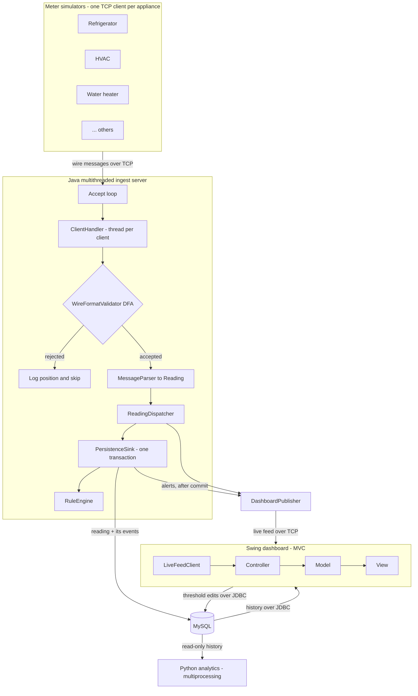
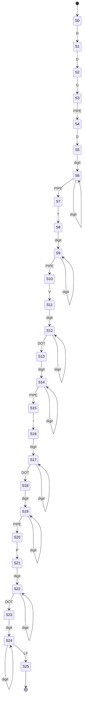

# Smart Home Energy Monitor

A monitoring system that ingests live power readings from simulated smart meters, one
per household appliance, persists them, evaluates them for power-quality problems in real
time, and presents both the live stream and historical trends to an operator. A separate
Python module mines the accumulated history for peak-hour demand, per-device usage trends,
and time-of-use cost.

This repository is the course project for **Advanced Programming Practice (APP)**. The
system is deliberately built to exercise, in one coherent application, all five
programming paradigms surveyed across the five units of the syllabus.

> **Project status.** Phases 1–3 are implemented: the database layer; the live pipeline end
> to end — meter simulators streaming over TCP, the validating DFA, the thread-per-client
> server and its dispatcher, and the Swing dashboard showing the feed; and detection and
> analytics — the rule engine raising spike, sag, and overload alerts into the dashboard and
> the `events` table, and the Python multiprocessing analytics with its peak-hour report and
> time-of-use cost model. **That is the graded core, running end to end.** The measured
> evidence and the Layer 2 additions (Phase 4) are still to come, against the phased plan in
> [Milestones](#milestones). Sections below describe the target system, and anything not yet
> built says which phase it belongs to — the [Engineering evidence](#engineering-evidence)
> tables are filled in as each measurement is actually taken, so an empty cell means "not yet
> measured", never "assumed".

---

## Table of contents

1. [Course context and syllabus mapping](#course-context-and-syllabus-mapping)
2. [The problem this system solves](#the-problem-this-system-solves)
3. [Architecture](#architecture)
4. [Feature scope](#feature-scope)
5. [Wire protocol and DFA validation](#wire-protocol-and-dfa-validation)
6. [Database schema](#database-schema)
7. [Rule engine detection logic](#rule-engine-detection-logic)
8. [Dashboard](#dashboard)
9. [Python analytics module](#python-analytics-module)
10. [Engineering evidence](#engineering-evidence)
11. [Failure-mode demonstrations](#failure-mode-demonstrations)
12. [Build and run](#build-and-run)
13. [Directory layout](#directory-layout)
14. [Milestones](#milestones)
15. [Design questions and where they are answered](#design-questions-and-where-they-are-answered)
16. [Team and ownership](#team-and-ownership)
17. [License](#license)

---

## Course context and syllabus mapping

- **Course:** Advanced Programming Practice (APP), 4 credits, 3rd semester
- **Programme:** B.Tech CSE (Software Engineering), SRMIST Kattankulathur, batch 2025–2029
- **Assessment:** 60% project, 20% report and viva; no final written exam (CLA-2 rubric,
  grading up to the Analyze/Evaluate level)

The course surveys five programming paradigms, one per unit. The project touches all five;
each unit maps to a concrete, self-contained component of this system, and each also carries
a **measurement** that supports the Analyze/Evaluate level of the rubric — a design claim is
only made here if a number in [Engineering evidence](#engineering-evidence) backs it.

| Unit | Syllabus topic | Component in this system | Supporting measurement |
| ---- | -------------- | ------------------------ | ---------------------- |
| I | Java OOP fundamentals (classes, interfaces, threading) | The domain model (`model`), the multithreaded ingest server (`server`), the meter simulators (`simulator`), and the strategy-based rule engine (`rules`). | Thread-per-client vs. thread-pool under load |
| II | GUI programming with Swing/AWT | The dashboard (`client`), structured as Model–View–Controller, showing live per-appliance usage, history, alerts, and live threshold editing. | Responsiveness with and without `SwingWorker` |
| III | Database connectivity via JDBC | The persistence layer (`db`): a connection factory plus one DAO per table over MySQL. | Naive vs. batched inserts; `EXPLAIN` with and without the index |
| IV | Python scripting and multiprocessing | The analytics satellite (`python/analytics`), which parallelises per-device trend analysis across a process pool. | Serial vs. `multiprocessing.Pool` speedup |
| V | Formal language / automata | The `WireFormatValidator` (`protocol`): a deterministic finite automaton that validates every meter message before it is parsed. | Randomised equivalence check against a reference regex |

The viva is design-justification heavy, so the rationale behind the non-obvious choices is
documented separately in [`docs/DESIGN.md`](docs/DESIGN.md), and indexed in
[Design questions and where they are answered](#design-questions-and-where-they-are-answered).

---

## The problem this system solves

Household electricity supply is not perfectly clean, and household loads are not perfectly
behaved. Voltage can rise above safe levels (a **spike**) or drop below them (a **sag**),
and an individual appliance can draw more power than its circuit is rated for (an
**overload**). Any of these can damage equipment or indicate a fault, but they are
invisible to a resident who only sees a monthly aggregate bill.

This system makes per-appliance electrical behaviour observable as it happens. Each
appliance has a smart meter that streams voltage, current, and power readings. The server
ingests every stream concurrently, records it, and checks each reading against configured
limits, raising a persisted alert the moment a limit is crossed. An operator watching the
dashboard sees each appliance's live usage, its recent history, and a running log of
alerts. Offline, the Python module answers the longer-horizon questions — when the home
peaks, how each device's consumption is trending, and what the usage actually costs under a
time-of-use tariff — that support load shifting and fault diagnosis.

Because real smart-meter hardware is out of scope for a course project, the meters are
simulated: one TCP client process per appliance, generating realistic readings (with
occasional injected anomalies so the detection path can be demonstrated).

---

## Architecture

The system is four cooperating processes (or process groups): the meter simulators, the
Java server, the Swing dashboard, and the Python analytics job. They communicate over TCP
and through the shared MySQL database.



Data flow from meter to dashboard, step by step:

1. A **meter simulator** formats a reading into the wire format and writes it to its TCP
   connection.
2. The server's **accept loop** (`EnergyMonitorServer`) has already handed that connection
   to a dedicated **`ClientHandler`** thread — one thread per connected meter.
3. The handler reads a line and passes it to the **`WireFormatValidator`** DFA. Malformed
   lines are rejected with the offending character position, logged, and skipped; the
   connection stays open.
4. An accepted line is turned into a typed `Reading` by **`MessageParser`**.
5. The handler hands the reading to the **`ReadingDispatcher`**, which fans it out to its
   sinks without the handler needing to know about any of them:
   - the **`DashboardPublisher`** pushes it to any subscribed dashboards;
   - the **`PersistenceSink`** stores it and evaluates it (both off the socket read path).
6. Inside that sink, and inside one transaction: `ReadingDao` inserts the reading, the
   **`RuleEngine`** evaluates it against the cached thresholds, and `EventDao` inserts any
   `Event` raised — bound to the `reading_id` the insert just generated. The transaction
   commits, and only then are the alerts forwarded to the dashboard's alert channel as
   `ALT` frames on the live feed. Persistence and detection share one sink because they
   share one transaction; the reasoning is in [`docs/DESIGN.md`](docs/DESIGN.md).
7. The **dashboard** shows the live stream (from the publisher over TCP) alongside history
   and past alerts (queried from MySQL over JDBC), and can write threshold changes back.
8. Independently, the **Python analytics** job reads the accumulated history from MySQL and
   produces its report.

The rationale for the key structural decisions — TCP vs UDP, thread-per-client vs a pool,
MySQL vs flat files, and keeping the rule engine off the ingest path — is in
[`docs/DESIGN.md`](docs/DESIGN.md).

---

## Feature scope

The scope is deliberately split into two layers. **Layer 1 is the graded core** — the system
described in the sections above, running end to end. **Layer 2** is a set of additions chosen
against one rule: each must be explainable in two sentences by the person who wrote it, and
each must either demonstrate a syllabus concept directly or produce evidence for a design
claim. Cleverness that cannot be reconstructed under questioning was deliberately left out.

### Layer 1 — core pipeline

| # | Capability | Package |
| - | ---------- | ------- |
| 1 | Meter simulators streaming realistic readings over TCP, with injectable anomalies | `simulator` |
| 2 | DFA validation of every line before parsing | `protocol` |
| 3 | Thread-per-client ingest server with a fan-out dispatcher | `server` |
| 4 | JDBC persistence of readings and events over MySQL | `db` |
| 5 | Strategy-based rule engine raising spike / sag / overload events | `rules` |
| 6 | Swing MVC dashboard: live per-appliance usage, history, alert log | `client` |
| 7 | Python multiprocessing analytics: peak hours and per-device trends | `python/analytics` |
| 8 | One-command environment (`docker compose up`) and a scripted demo scenario | `docker-compose.yml`, `scripts/` |

Items 1–7 are the system as originally specified. Item 8 exists because the most expensive
failure in a project demo is an environment that does not start on the evaluator's machine,
or a live demo that depends on a random anomaly firing on cue — see
[Build and run](#build-and-run).

### Layer 2 — additions, by unit

| Unit | Addition | What it demonstrates |
| ---- | -------- | -------------------- |
| I | **Swappable accept strategy** — thread-per-client and fixed thread pool behind one interface, plus a load-test harness | Turns the concurrency-model argument in `DESIGN.md` into a measured comparison |
| I | **Graceful shutdown** — stop accepting, drain in-flight handlers, close connections | Thread lifecycle and coordinated termination |
| I | **Race-condition demonstration** — an unsynchronised counter losing updates, then the corrected version | Why the synchronisation in the dispatcher is there |
| II | **Custom-painted live strip chart** drawn in `paintComponent` with `Graphics2D` | Owner-drawn Swing components, not a charting library |
| II | **`SwingWorker` responsiveness demonstration** — the same query on and off the EDT | The single-threaded event dispatch model |
| II | **Live threshold editor** — edit a limit in the UI, write through JDBC, engine reloads, alert fires | One action exercising Units I, II, and III together |
| II | **DFA state panel** — highlights the current automaton state as characters arrive | Makes the Unit V automaton visible while it runs |
| III | **Batched, pooled inserts** measured against naive autocommit | Round-trip cost and why batching matters |
| III | **Transaction with rollback** — reading and event written atomically, failure forced mid-transaction | ACID behaviour over JDBC |
| III | **SQL-injection demonstration** — a concatenated query exploited, then the parameterised fix | Why every DAO uses `PreparedStatement` |
| III | **`EXPLAIN` comparison** with and without the `(device_id, reading_ts)` index | Index selection and query planning |
| IV | **Serial vs. `Pool` timing** across the per-device analyses | The actual speedup from process-level parallelism |
| IV | **Time-of-use cost model** — tariff bands, monthly bill, and load-shifting savings | Turns raw telemetry into an actionable recommendation |
| V | **Error-locating rejection** — reports the column and the expected character set on failure | The trap state as a diagnostic, not just a reject |
| V | **Randomised equivalence check** — ~100k generated strings, DFA accept vs. reference regex match | Empirical evidence the automaton recognises the intended language |

---

## Wire protocol and DFA validation

### Message format

Meters and server speak a line-oriented text protocol. One reading is one line, terminated
by a newline (`\n`). A line has a fixed `RDG` header followed by five tagged, pipe-delimited
fields, in a fixed order:

```
RDG|D<deviceId>|T<epochMillis>|V<voltage>|I<current>|P<power>\n
```

| Token | Tag | Type | Meaning |
| ----- | --- | ---- | ------- |
| `RDG` | — | literal header | marks the start of a reading frame |
| `D`   | `D` | unsigned integer | device id (foreign key to `devices`) |
| `T`   | `T` | unsigned integer | meter-side timestamp, epoch milliseconds |
| `V`   | `V` | decimal (`digits.digits`) | RMS voltage, volts |
| `I`   | `I` | decimal (`digits.digits`) | RMS current, amperes |
| `P`   | `P` | decimal (`digits.digits`) | real power, watts |

Example of a well-formed line:

```
RDG|D3|T1721817600000|V228.40|I4.10|P998.20
```

The single source of truth for the delimiter, tags, header, and terminator is
`protocol.MeterMessage`, referenced by both the simulator (which formats) and the
validator/parser (which read), so producer and consumer cannot drift apart. It also defines
the dashboard live feed's subscribe handshake, which keeps every string this system puts on
a wire declared in one file. The decimal fields are formatted under `Locale.ROOT`: the
default would render `228,40` under a locale such as `fr-FR`, and every meter would then be
rejected on that machine and nowhere else.

### The alert frame

The dashboard's live feed carries one more frame type, added in Phase 3: the alerts the rule
engine raises. A reading frame cannot express one, which is the price `DESIGN.md` predicted
for reusing the meter format on the feed. It is built from the same pieces — the header, the
delimiter, one tag per field, the newline terminator — so it is read by the same kind of
code:

```
ALT|D<deviceId>|T<epochMillis>|E<eventType>|S<severity>|M<measured>|L<limit>|X<detail>\n
```

```
ALT|D2|T1721817600000|EVOLTAGE_SPIKE|SCRITICAL|M264.00|L253.00|XLiving Room HVAC: supply at 264.00 V, above the 253.00 V ceiling
```

Three details are deliberate. The **detail is last** and is free text, so it may contain
spaces; the delimiter and the terminator are stripped from it on the way out, because a rule
description containing a `|` would otherwise produce a frame that splits into the wrong
number of fields. The **`triggering_reading_id` is not on the wire** — it is a database key,
and a dashboard running without a database could do nothing with it but be misled, so
everything the alert log displays is carried on the frame itself. And alert frames are **not
run through the DFA**: the automaton recognises the meter grammar, which is the language the
untrusted side of the system speaks. Alerts are checked instead by `MessageParser.parseAlert`,
which validates every field rather than assuming the sender got it right.

Alerts travel on the same connection as the readings, and therefore in order behind the
reading that caused them: two channels would let the alert about a 264 V reading arrive
before the 264 V itself, and a tile would go red for a value it was not showing.

### The validating DFA

Because the format is a regular language, it is validated by a **deterministic finite
automaton** (`protocol.WireFormatValidator`) before any field is parsed. The automaton
consumes the line one character at a time; it accepts only if the entire line matches the
grammar, and it drops to a non-accepting dead (trap) state on the first character that does
not fit. Validation is therefore single-pass, O(n) in the line length, with O(1) memory —
and malformed input never reaches the numeric parsing code.

Input tokens used below: `digit` is any of `0`–`9`; `PIPE` is `|`; `DOT` is `.`; `LF` is
the newline `\n`; letters stand for themselves. Any `(state, input)` pair not listed
transitions to the dead state.



Transition table (dead-state transitions omitted; `S25` is the sole accepting state):

| State | On input | Next state | Reading |
| ----- | -------- | ---------- | ------- |
| S0 | `R` | S1 | start of header |
| S1 | `D` | S2 | header |
| S2 | `G` | S3 | header complete |
| S3 | `PIPE` | S4 | field separator |
| S4 | `D` | S5 | device tag |
| S5 | `digit` | S6 | first device-id digit |
| S6 | `digit` | S6 | more device-id digits |
| S6 | `PIPE` | S7 | end of device id |
| S7 | `T` | S8 | timestamp tag |
| S8 | `digit` | S9 | first timestamp digit |
| S9 | `digit` | S9 | more timestamp digits |
| S9 | `PIPE` | S10 | end of timestamp |
| S10 | `V` | S11 | voltage tag |
| S11 | `digit` | S12 | voltage integer part |
| S12 | `digit` | S12 | more integer digits |
| S12 | `DOT` | S13 | decimal point |
| S13 | `digit` | S14 | voltage fraction (>=1 digit required) |
| S14 | `digit` | S14 | more fraction digits |
| S14 | `PIPE` | S15 | end of voltage |
| S15 | `I` | S16 | current tag |
| S16 | `digit` | S17 | current integer part |
| S17 | `digit` | S17 | more integer digits |
| S17 | `DOT` | S18 | decimal point |
| S18 | `digit` | S19 | current fraction |
| S19 | `digit` | S19 | more fraction digits |
| S19 | `PIPE` | S20 | end of current |
| S20 | `P` | S21 | power tag |
| S21 | `digit` | S22 | power integer part |
| S22 | `digit` | S22 | more integer digits |
| S22 | `DOT` | S23 | decimal point |
| S23 | `digit` | S24 | power fraction |
| S24 | `digit` | S24 | more fraction digits |
| S24 | `LF` | S25 | **accept** |

Only a line that drives the DFA into `S25` is handed to `MessageParser`; everything else is
rejected at the door. Splitting responsibilities this way — the DFA decides *whether* a line
is legal, the parser only *extracts* fields from a line already known to be legal — keeps
each side small and independently testable.

### Error-locating rejection

A plain accept/reject verdict is enough to protect the parser but useless for diagnosing a
misbehaving meter. Because the automaton already knows the index at which it entered the trap
state and which transitions were defined for the state it left, rejection returns a
`ValidationResult` carrying the failure position and the set of characters that would have
been legal there:

```
RDG|D3|T1721817600000|V228.4x|I4.10|P998.20
                            ^
  col 28: in state S14, expected digit or '|', got 'x'
```

This costs one integer of extra state and no additional passes over the input — the
diagnostic falls out of the automaton's structure rather than being bolted on.

### Verifying the automaton

The wire format is small enough to write a reference regular expression for, which gives a
cheap and convincing correctness argument: a randomised test generates roughly 100,000
strings — well-formed lines, lines with one mutated character, truncated lines, and entirely
random noise — and asserts that

```
validator.accepts(s) == referencePattern.matcher(s).matches()
```

for every one. Agreement across that corpus is strong empirical evidence that the
hand-constructed transition table recognises exactly the intended language. Targeted
`WireFormatValidatorTest` cases cover the boundaries the fuzzer is unlikely to hit by chance:
empty input, header-only input, a missing fractional digit, a missing terminator, and
trailing characters after the newline.

---

## Database schema

MySQL 8.x. Four tables: static reference data (`devices`, `thresholds`) and the growing
time series (`readings`, `events`). Full DDL is in [`sql/schema.sql`](sql/schema.sql); seed
data is in [`sql/seed.sql`](sql/seed.sql).

### `devices` — the appliance catalogue

One row per monitored appliance/meter; changes rarely.

| Column | Type | Purpose |
| ------ | ---- | ------- |
| `device_id` | `INT` PK, auto-increment | surrogate key referenced everywhere |
| `name` | `VARCHAR(64)`, unique | human label, e.g. "Kitchen Refrigerator" |
| `appliance_type` | `VARCHAR(32)` | category used for grouping/analytics |
| `location` | `VARCHAR(64)` | room or circuit |
| `rated_voltage` | `DECIMAL(6,2)` | nominal operating voltage (V) |
| `rated_power_watts` | `DECIMAL(10,2)` | manufacturer power rating (W); baseline for overload limits |
| `created_at` | `TIMESTAMP` | row creation time |

### `readings` — the time series

The high-volume table; one row per meter reading.

| Column | Type | Purpose |
| ------ | ---- | ------- |
| `reading_id` | `BIGINT` PK, auto-increment | surrogate key |
| `device_id` | `INT` FK → `devices` | which appliance produced the reading |
| `reading_ts` | `DATETIME(3)` | measurement time reported by the meter (millisecond precision) |
| `voltage` | `DECIMAL(6,2)` | RMS volts |
| `current_amp` | `DECIMAL(6,2)` | RMS amperes |
| `power_watts` | `DECIMAL(10,2)` | real power (W) |
| `received_at` | `TIMESTAMP(3)` | server ingest time; differs from `reading_ts` by network/queue latency |

Indexed on `(device_id, reading_ts)` to back the dashboard's "this device over this window"
history queries and the analytics scans. The effect of that index on the query plan is
measured in [Engineering evidence](#engineering-evidence).

### `thresholds` — detection limits

The limits the rule engine evaluates against. A `NULL` `device_id` is a **global default**
applied to any device without a specific override.

| Column | Type | Purpose |
| ------ | ---- | ------- |
| `threshold_id` | `INT` PK, auto-increment | surrogate key |
| `device_id` | `INT` FK → `devices`, nullable | target device, or `NULL` for the global default |
| `metric` | `ENUM('VOLTAGE','CURRENT','POWER')` | which quantity this row bounds |
| `min_value` | `DECIMAL(10,2)`, nullable | lower bound; a reading below it is a sag/under condition |
| `max_value` | `DECIMAL(10,2)`, nullable | upper bound; a reading above it is a spike/overload |
| `description` | `VARCHAR(128)`, nullable | human note |

A unique key on `(device_id, metric)` enforces one row per device-and-metric (with the
`NULL` device row acting as the default for that metric). This is the table the dashboard's
[threshold editor](#dashboard) writes to.

### `events` — power-quality alerts

One row per alert raised by the rule engine.

| Column | Type | Purpose |
| ------ | ---- | ------- |
| `event_id` | `BIGINT` PK, auto-increment | surrogate key |
| `device_id` | `INT` FK → `devices` | the offending appliance |
| `triggering_reading_id` | `BIGINT` FK → `readings`, nullable | the reading that tripped the rule (`SET NULL` on delete) |
| `event_type` | `ENUM('VOLTAGE_SPIKE','VOLTAGE_SAG','LOAD_OVERLOAD')` | what was detected |
| `severity` | `ENUM('INFO','WARNING','CRITICAL')` | how far past the limit |
| `measured_value` | `DECIMAL(10,2)` | the value observed |
| `threshold_value` | `DECIMAL(10,2)` | the limit that was crossed |
| `detail` | `VARCHAR(255)`, nullable | human-readable description |
| `detected_at` | `TIMESTAMP(3)` | server-side detection time |

Indexed on `(device_id, detected_at)` and on `detected_at` to serve per-device alert
history and the "most recent alerts" view.

A reading and the event it triggers are written in a **single transaction**, so the database
can never hold an alert that points at a reading which was never committed — demonstrated
explicitly in [Failure-mode demonstrations](#failure-mode-demonstrations).

---

## Rule engine detection logic

The rule engine (`rules.RuleEngine`) holds a list of independent `DetectionRule` strategies
and applies every rule to every reading the dispatcher gives it. It reads the thresholds
once at start-up into an in-memory `RuleContext` (device-specific rows override the global
default), so the hot evaluation path does no database round-trips.

Three rules ship:

- **`VoltageSagRule`** — fires when `reading.voltage < min_value` of the device's `VOLTAGE`
  threshold. Produces a `VOLTAGE_SAG` event.
- **`VoltageSpikeRule`** — fires when `reading.voltage > max_value` of the device's
  `VOLTAGE` threshold. Produces a `VOLTAGE_SPIKE` event.
- **`LoadOverloadRule`** — fires when `reading.power_watts > max_value` of the device's
  `POWER` threshold (typically the rated wattage plus a start-up tolerance). Produces a
  `LOAD_OVERLOAD` event.

With the seeded defaults, the supply band is 207–253 V (±10% around a 230 V nominal), so a
reading of 262 V raises a `VOLTAGE_SPIKE` and 198 V raises a `VOLTAGE_SAG`; a refrigerator
(overload ceiling 500 W) drawing 540 W raises a `LOAD_OVERLOAD`. A threshold row bounds one
device and one metric; a row with a `NULL` device id is the default for any device without
an override. A metric with **no** row at all is unbounded and raises nothing — a missing
threshold means nobody has said what is normal here, and inventing a limit would raise alerts
against numbers no one configured.

### Severity

Each rule sets the event's **severity** from the size of the excursion, as a fraction of the
limit rather than an absolute margin: one rule bounds a router at 40 W and a water heater at
3300 W, and "50 W over" is a fault on the first and noise on the second, while "10% over"
means the same thing on both.

The two cut-offs are each rule's own, because voltage and power are not comparable on that
scale — a supply drifting 5% out of band is a serious event, while a motor drawing 5% over
its rating on start-up is an appliance working normally:

| Rule | `WARNING` at | `CRITICAL` at | Worked example |
| ---- | ------------ | ------------- | -------------- |
| `VoltageSpikeRule` | 1% past the ceiling | 4% past | 256 V → `WARNING`; 264 V → `CRITICAL` |
| `VoltageSagRule` | 1% below the floor | 4% below | 205 V → `WARNING`; 198 V → `CRITICAL` |
| `LoadOverloadRule` | 2% past the ceiling | 20% past | 540 W vs 500 W → `WARNING`; 625 W → `CRITICAL` |

The seeded power ceilings already include a start-up allowance, which is why the overload
bands are the wider pair.

### Where the events go

The engine **evaluates but does not persist**: it is a pure function from a reading to the
alerts it deserves, which is what makes it testable without a database. Writing is
`PersistenceSink`'s job, because an event's `triggering_reading_id` is the key of a row being
inserted in the same transaction — so whoever owns that transaction has to own the event
insert too, or the two cannot be atomic. The sink inserts the reading, calls the engine with
the key it got back, inserts the events, commits, and only then publishes the alerts to the
dashboards. Publishing last is deliberate: an alert on screen that a rolled-back transaction
means never happened is one the operator cannot go back and find in the log.

New rule types are added by writing another `DetectionRule` implementation and registering
it; the engine, the sink, and the ingest path are untouched.

The `RuleContext` is **reloadable**: it is `volatile` and replaced wholesale, never mutated,
so a worker mid-evaluation sees one consistent set of thresholds and the next reading picks
up the edit. That is what the Phase 4 threshold editor commits into. Detection itself runs on
the dispatcher's worker rather than on the `ClientHandler` read loop, so a burst of anomalies
cannot slow meter ingestion. The reasoning is expanded in [`docs/DESIGN.md`](docs/DESIGN.md).

Detection comes up **with persistence and not without it**: the thresholds live in the
database, so `--no-persistence` starts a server that validates, dispatches, and broadcasts
readings but evaluates nothing.

---

## Dashboard

The Swing client is structured as Model–View–Controller: `LiveFeedClient` receives the
published stream, the `DashboardController` applies it to an observable `DashboardModel`, and
the views repaint from the model. All socket reads and JDBC queries run off the event
dispatch thread via `SwingWorker`; only model-to-view updates touch the EDT.

| Panel | Shows | Notes | Status |
| ----- | ----- | ----- | ------ |
| `AppliancePanel` | One tile per appliance: live voltage, current, power, and a sparkline of recent load | Drawn entirely in `paintComponent` with `Graphics2D`; colour reflects the most severe active condition | built |
| `HistoryChartPanel` | Per-device history over a selectable window, read over JDBC | Query runs on a `SwingWorker`, never on the EDT | built |
| `EventLogPanel` | Running alert log, newest first, severity-coloured | Backfilled from `events` at start-up, then fed live by the publisher's alert channel | built |
| `LiveChartPanel` | A scrolling strip chart of the last ~60 seconds of load across the home | Drawn directly in `paintComponent` with `Graphics2D` — no charting library | Layer 2, Phase 4 |
| `ThresholdEditorPanel` | Editable per-device limits, committed through `ThresholdDao` | Writes to MySQL, then triggers a `RuleContext` reload | Layer 2, Phase 4 |
| `DfaStatePanel` | The automaton's current state as characters stream in | Highlights the active row of the transition table; flashes the trap state on rejection | Layer 2, Phase 4 |

The live feed carries the same `RDG|…` frames the meters send, so the dashboard decodes it
with the same `WireFormatValidator` and `MessageParser` the server uses on the way in — one
grammar, one parser, tested once. The subscribe handshake is defined alongside the frame
format in `protocol.MeterMessage`, as is the [`ALT|…` alert frame](#the-alert-frame) the same
connection carries.

An arriving alert does two things: it goes to the top of the event log, and it colours the
tile of the appliance it names. The colour is **held for three seconds** rather than cleared
by the next reading — an alert arrives immediately behind the reading that caused it, so
clearing on the next one would make a sustained fault flash green once a second, and a tile
that spends half a fault claiming the appliance is fine is worse than no tile. A tile
therefore stays coloured for as long as the condition lasts and returns to normal a moment
after it stops. Where one reading raises two alerts, the more severe one is the colour.

`DashboardModel` refuses to be mutated from anywhere but the event dispatch thread, and
throws naming the offending thread if it is. Swing components are not thread-safe, and the
symptom of getting that wrong is not an exception but a repaint that goes missing once an
hour on someone else's machine.

The threshold editor is the shortest path through the whole system in a single user action:
a UI edit (Unit II) becomes a JDBC write (Unit III) that reloads the rule engine (Unit I) and
changes which meter readings raise alerts (Unit V validates those readings on the way in).

---

## Python analytics module

`python/analytics` is a standalone, read-only companion that connects to the same MySQL
database and mines the accumulated history for insights the live dashboard does not compute.
It is run offline (for the report and demos), independent of the Java processes.

- `config.py` — loads MySQL connection parameters from the environment.
- `db.py` — opens connections and runs the read-only history queries. Every one is a
  `SELECT`, and every parameter is bound rather than formatted into the SQL — the same rule
  the Java DAOs follow with `PreparedStatement`, for the same reason.
- `peak_hours.py` — buckets all readings by hour-of-day (00–23) and ranks the hours at which
  the whole home draws the most power.
- `device_trends.py` — analyses one device's history (average, min/max, duty cycle, direction
  of trend). This is the unit of work that is parallelised.
- `cost_model.py` — applies a time-of-use tariff to the measured consumption: the monthly
  bill per device, and the saving available from shifting a deferrable load (water heater,
  washing machine) out of the peak band.
- `benchmark.py` — runs the per-device analyses serially and then through the pool, and
  reports the wall-clock times and the resulting speedup.
- `runner.py` — the orchestrator: reads the device list, maps `device_trends.analyze_device`
  across a `multiprocessing.Pool` (**one worker process per device**, so the per-device
  scans overlap instead of running serially), then runs the peak-hour and cost analyses, and
  renders all of them as plain-text tables.
- `__main__.py` — the `python -m analytics` entry point, guarded by
  `if __name__ == "__main__"` as `multiprocessing` requires.

The `multiprocessing` step is the syllabus focus of Unit IV: the workload partitions cleanly
by device, so it is a natural fit for a process pool. `benchmark.py` exists so the choice can
be defended with a measured speedup rather than an assertion — the number lands in
[Engineering evidence](#engineering-evidence). (`benchmark.py` arrives with Phase 4; the rest
of the module is built.)

Each module splits its fetching from its arithmetic — `analyze_device` opens the connection,
`summarise` does the sums — so every analysis function is a pure function over rows. That is
what makes the Python suite runnable with neither MySQL nor the driver installed, and it is
why the worker is `functools.partial(analyze_device, since=...)` rather than a closure: the
callable is pickled and sent to each process, and only something importable by name survives
that.

**Averaging, and why it is done per device first.** The obvious aggregation — add every
`power_watts` in an hour and divide by the row count — answers a question nobody asked: it
gives the average draw of a *typical appliance*, and a meter that reports twice as often as
its neighbours pulls the answer towards itself. What the home draws at 19:00 is the sum over
appliances of what each is drawing, so each device is averaged over its own samples first and
the averages are added. The result is a load in watts that is comparable between hours however
the sampling varied, and it converts straight into kWh for the cost model.

The cost model turns the telemetry into something actionable: rather than reporting only that
the water heater averages 1.8 kW between 18:00 and 21:00, it reports what those hours cost
under the peak tariff and what the same consumption would cost shifted into the off-peak
band. Tariff bands are configuration, not code, so they can be matched to a local supplier;
the default is a plausible domestic schedule of off-peak 22:00–06:00, standard 06:00–18:00,
and peak 18:00–22:00. A tariff that fails to price all 24 hours is rejected rather than
silently costing part of the day at zero. Only **deferrable** loads (washer, heater,
dishwasher) are recommended for shifting: a refrigerator's peak-band energy is expensive and
cannot be rescheduled, and a report that suggests running it at 02:00 is one that gets
ignored wholesale.

---

## Engineering evidence

The rubric grades to the Analyze/Evaluate level, so each significant design choice is backed
by a measurement taken on this system rather than by assertion. These are the four
experiments; each is reproducible with a single command, and the numbers below are filled in
as each is run.

### 1. Concurrency model — thread-per-client vs. thread pool

`DESIGN.md` argues that thread-per-client is correct *at this project's scale*. The harness
(`bench.IngestBenchmark`) drives N synthetic meters at a fixed rate through each accept
strategy and records sustained throughput, latency percentiles, and peak thread count.

```bash
mvn exec:java -Dexec.mainClass=com.smarthome.energy.bench.IngestBenchmark -Dexec.args="--meters 10,50,200 --duration 60s"
```

| Meters | Strategy | Throughput (readings/s) | p50 latency (ms) | p99 latency (ms) | Peak threads |
| ------ | -------- | ----------------------- | ---------------- | ---------------- | ------------ |
| 10 | thread-per-client | | | | |
| 10 | pool (8) | | | | |
| 50 | thread-per-client | | | | |
| 50 | pool (8) | | | | |
| 200 | thread-per-client | | | | |
| 200 | pool (8) | | | | |

Expected shape of the result: indistinguishable at 10 meters, with the pool pulling ahead as
the connection count grows. That is precisely the argument — the simpler model is chosen
because the measurement shows it costs nothing *here*, not because pools are bad.

### 2. JDBC insert strategy

`bench.JdbcBatchBenchmark` inserts a fixed number of readings three ways.

| Strategy | Rows | Wall clock (s) | Rows/s |
| -------- | ---- | -------------- | ------ |
| Autocommit, one `INSERT` per row | 50,000 | | |
| `PreparedStatement`, batched (500) | 50,000 | | |
| Batched + pooled connection | 50,000 | | |

### 3. Index effectiveness

The dashboard's history query, planned with and without the `(device_id, reading_ts)` index:

```sql
EXPLAIN SELECT * FROM readings
 WHERE device_id = 3 AND reading_ts BETWEEN ? AND ?
 ORDER BY reading_ts;
```

| Index present | `type` | `rows` examined | `Extra` |
| ------------- | ------ | --------------- | ------- |
| No | | | |
| Yes | | | |

### 4. Python parallel speedup

```bash
python -m analytics.benchmark
```

| Mode | Workers | Wall clock (s) | Speedup |
| ---- | ------- | -------------- | ------- |
| Serial | 1 | | 1.00× |
| `multiprocessing.Pool` | 2 | | |
| `multiprocessing.Pool` | 4 | | |
| `multiprocessing.Pool` | 8 | | |

The per-device analysis is IO-bound on the database, so the curve is expected to flatten once
workers outnumber the connections the database will usefully serve in parallel — worth noting
rather than hiding, since it is the honest reason the speedup is sub-linear.

---

## Failure-mode demonstrations

Four short, deliberately-broken paths are kept in the codebase behind flags, each paired with
its corrected counterpart. They exist because demonstrating a failure is stronger evidence of
understanding than asserting the fix was necessary, and each is a direct hit on a syllabus
teaching point.

| Demonstration | Broken behaviour | Corrected behaviour | Unit |
| ------------- | ---------------- | ------------------- | ---- |
| **Lost update** | Dispatcher counters incremented without synchronisation under concurrent handlers; totals come out short | Synchronised / atomic counters; totals exact | I |
| **Frozen UI** | The history query run directly on the event dispatch thread; the window stops repainting until it returns | The same query on a `SwingWorker`; the UI stays live | II |
| **SQL injection** | A device-name lookup built by string concatenation, exploited against a throwaway table | The same lookup as a parameterised `PreparedStatement` | III |
| **Partial write** | Reading committed, event insert then fails — leaving an orphaned reading | Both in one transaction; the failure rolls back cleanly | III |

Each runs from the demo script (`scripts/demo.sh --failure <name>`) and prints the before and
after side by side.

---

## Build and run

### Prerequisites

- JDK 17 or newer
- Apache Maven 3.9+
- Docker and Docker Compose (recommended), **or** a local MySQL 8.x
- Python 3.10+ (for the analytics module)

### Quick start

With Docker available, the database comes up already schema'd and seeded:

```bash
docker compose up -d          # MySQL 8, schema.sql and seed.sql applied on first boot
cp src/main/resources/db.properties.example src/main/resources/db.properties
mvn clean package
```

Then start the three processes in three terminals, as under
[Manual setup](#manual-setup-no-docker) steps 4–6. (`scripts/demo.sh`, which starts them
together and drives the scripted scenarios, arrives with Phase 4.)

`db.properties` is git-ignored so credentials never enter version control. The example file
already matches the Docker Compose credentials, so no editing is needed for the default
setup.

### Manual setup (no Docker)

Run the steps **in order** — the schema must exist before the server starts, and the server
must be running before the simulators or dashboard connect.

**1. Create the schema and seed data**

```bash
mysql -u root -p < sql/schema.sql
mysql -u root -p smart_home_energy < sql/seed.sql
```

Optionally create a dedicated application user:

```sql
CREATE USER 'energy_app'@'localhost' IDENTIFIED BY 'change_me';
GRANT SELECT, INSERT, UPDATE, DELETE ON smart_home_energy.* TO 'energy_app'@'localhost';
FLUSH PRIVILEGES;
```

**2. Configure database credentials**

```bash
cp src/main/resources/db.properties.example src/main/resources/db.properties
# edit db.properties with your JDBC URL, user, and password
```

**3. Build**

```bash
mvn clean package
```

**4. Start the server**

```bash
mvn exec:java -Dexec.mainClass=com.smarthome.energy.server.EnergyMonitorServer
```

(The server main is the configured default, so a bare `mvn exec:java` also starts it.)

| Option | Effect |
| ------ | ------ |
| `--meter-port N` | override the meter ingest port |
| `--dashboard-port N` | override the live-feed port |
| `--no-persistence` | run the live pipeline with no MySQL at all: readings are validated, dispatched, and broadcast to dashboards, but not stored. A diagnostic mode for working on the networking path — history, alerts, and the analytics have nothing to read without it |

The server prints a status line every ten seconds (`meters=6 subscribers=1 accepted=…
delivered=… dropped=… queued=… rate=…/s`) and drains the dispatcher on shutdown.

The swappable accept strategy (`--strategy pool --pool-size 8`) is a Layer 2 addition and
arrives with Phase 4; until then the server is thread-per-client, as `DESIGN.md` argues it
should be at this scale.

**5. Start the meter simulators** — in a second terminal:

```bash
mvn exec:java -Dexec.mainClass=com.smarthome.energy.simulator.SimulatorLauncher
```

| Option | Effect |
| ------ | ------ |
| `--host H`, `--port N` | where the server is |
| `--interval MS` | milliseconds between readings from each meter |
| `--anomaly P` | probability that a reading is an injected spike, sag, or overload |
| `--corrupt P` | probability that a frame is deliberately damaged before being sent, to exercise the server's DFA rejection path |
| `--devices 1,2,3` | run a subset of the seeded fleet |
| `--seed N` | seed the generators, so an interesting run can be replayed exactly |

**6. Start the dashboard** — in a third terminal:

```bash
mvn exec:java -Dexec.mainClass=com.smarthome.energy.client.DashboardApp
```

| Option | Effect |
| ------ | ------ |
| `--host H`, `--port N` | where the server's live feed is |
| `--no-db` | skip JDBC entirely: live tiles only, no history or alerts |

The dashboard opens on the live feed alone if the database is unreachable, rather than
refusing to start — the live view is most useful precisely when something behind it has
broken. It reconnects on its own if the server restarts.

**7. Run the Python analytics** (any time after data has accumulated):

```bash
cd python
python -m venv .venv
. .venv/bin/activate
pip install -r requirements.txt
python -m analytics
```

| Option | Effect |
| ------ | ------ |
| `--hours N` | only analyse the last N hours (default: all stored history) |
| `--top N` | how many peak hours to list (default: 5) |
| `--processes N` | worker processes to use (default: one per device) |

Connection settings come from `ENERGY_DB_HOST`, `ENERGY_DB_PORT`, `ENERGY_DB_USER`,
`ENERGY_DB_PASSWORD`, and `ENERGY_DB_NAME`, defaulting to the Docker Compose credentials —
so with the default setup nothing needs exporting. (The Java side deliberately refuses to
default its JDBC URL; this module may, because it only ever reads, so the cost of guessing
wrong here is a connection error rather than a write to the wrong database.)

### The scripted demo

A live demonstration should never depend on a random anomaly firing at the right moment, so
the simulators can replay a fixed scenario instead of generating purely random readings:

```bash
./scripts/demo.sh --scenario incident
```

The `incident` scenario runs for about three minutes and is deterministic:

| Time | What happens | What to point at |
| ---- | ------------ | ---------------- |
| 0:00–0:45 | All appliances nominal | Live tiles and strip chart populating |
| 0:45 | Deliberate malformed line injected | `DfaStatePanel` hits the trap state; the rejection logs its column |
| 1:00 | HVAC voltage climbs to 264 V | `VOLTAGE_SPIKE`, CRITICAL, in the event log |
| 1:30 | Supply sags to 196 V across all devices | Simultaneous `VOLTAGE_SAG` events on every device |
| 2:00 | Refrigerator draws 540 W against a 500 W ceiling | `LOAD_OVERLOAD`, WARNING |
| 2:20 | Threshold edited live in the dashboard to 520 W | Engine reloads; the next reading no longer alerts |
| 2:40 | All values return to nominal | Event log stops growing; tiles return to green |

### Tests

```bash
mvn test                      # unit tests, including the DFA suite
mvn test -Dtest=WireFormatFuzzTest   # ~100k randomised DFA vs. regex comparisons

cd python && python -m unittest discover -s tests -t .   # the analytics suite
```

123 Java tests and 33 Python tests at the end of Phase 3. The eight DAO round-trip tests skip
themselves with a stated reason when no database is reachable, so the build stays green on a
machine without Docker; everything else — the protocol, the dispatcher, the waveform
generator, the rule engine, the dashboard model, and the analytics — runs anywhere.

Two of those suites are worth a note, because "no database" would otherwise mean "not
tested":

- `PersistenceSinkTest` runs against `RecordingDatabase`, a JDBC driver in the test tree that
  records the calls made to it instead of storing anything. The claim under test — reading
  and events on one connection, in one transaction, alerts published only after the commit,
  everything rolled back if any insert fails — is a property of the *sequence of JDBC calls*,
  so it can be asserted exactly, on any machine. A test that needed MySQL would be skipped on
  every machine that lacks it, which is precisely where a regression would hide.
- The Python suite exercises the analysis functions, which take rows and return values, so it
  needs neither MySQL nor the MySQL driver installed.

### Benchmarks

```bash
mvn exec:java -Dexec.mainClass=com.smarthome.energy.bench.IngestBenchmark
mvn exec:java -Dexec.mainClass=com.smarthome.energy.bench.JdbcBatchBenchmark
python -m analytics.benchmark
```

---

## Directory layout

```
smart-home-energy-monitor/
├── pom.xml                         Maven build: Java 17, mysql-connector-j, exec targets
├── docker-compose.yml              MySQL 8 with schema + seed applied on first boot
├── LICENSE                         MIT license
├── README.md                       This document
├── .gitignore                      Java, Python, and IDE artifacts to exclude
├── scripts/
│   └── demo.sh                     Starts the stack; runs scripted scenarios and failure demos
├── sql/                            Database scripts (load in order: schema, then seed)
│   ├── schema.sql                  Database and table definitions
│   └── seed.sql                    Seed devices and detection thresholds
├── docs/                           Report and design notes
│   └── DESIGN.md                   Design-decision rationale (for the viva)
├── python/                         Python analytics module root
│   ├── requirements.txt            Analytics dependencies
│   ├── analytics/                  The analytics package (multiprocessing)
│   │   ├── config.py               MySQL settings from ENERGY_DB_* with local defaults
│   │   ├── db.py                   Read-only history queries, one connection per worker
│   │   ├── device_trends.py        The per-device analysis mapped across the pool
│   │   ├── peak_hours.py           Whole-home hour-of-day demand profile
│   │   ├── cost_model.py           Time-of-use tariff, bill, and load-shift savings
│   │   ├── runner.py               Orchestration and report rendering
│   │   └── benchmark.py            Serial vs. Pool timing comparison (Phase 4)
│   └── tests/                      Analytics unit tests (no database required)
└── src/
    ├── main/
    │   ├── resources/              Runtime configuration (db.properties)
    │   └── java/com/smarthome/energy/
    │       ├── model/              Shared domain value objects and enums
    │       ├── protocol/           Wire format, the validating DFA, and the parser
    │       ├── server/             Multithreaded TCP ingest server + accept strategies
    │       ├── db/                 JDBC connection factory and DAOs
    │       ├── rules/              Rule-based power-quality detection engine
    │       ├── simulator/          Meter simulators (TCP clients) and scenario playback
    │       ├── bench/              Ingest and JDBC benchmark harnesses
    │       └── client/             Swing dashboard root (entry point + networking/data)
    │           ├── model/          MVC model: observable dashboard state
    │           ├── view/           MVC view: Swing window and panels
    │           └── controller/     MVC controller: mediates data and view
    └── test/
        └── java/                   Unit tests, incl. the DFA suite and the fuzz comparison
```

---

## Milestones

- **Phase 1 — Persistence foundation. Done.** MySQL schema in place, Docker Compose bringing
  it up reproducibly, and a single-client JDBC CRUD path working (insert a reading, read it
  back). Establishes the `db` layer and the schema.
- **Phase 2 — Live pipeline. Done.** The wire protocol and the validating DFA; TCP sockets
  and the multithreaded, thread-per-client server; simulators streaming; readings flowing
  live into the dashboard. Establishes the `server`, `simulator`, `protocol`, and `client`
  paths end to end. **This is the point at which the project is complete against its core
  specification**, less the detection that Phase 3 adds.
- **Phase 3 — Detection and analytics. Done.** The strategy-based rule engine and its
  reloadable threshold context; alerts written with their reading in one transaction, and
  published to the dashboard as a second frame type on the live feed; the Python
  multiprocessing analytics, cost model, and peak-hour report. Completes the graded core.
- **Phase 4 — Evidence and polish.** The Layer 2 additions: the benchmark harnesses and the
  four [Engineering evidence](#engineering-evidence) measurements, the failure-mode
  demonstrations, the remaining Layer 2 panels, the scripted demo scenario, and the
  design-thinking report.

The DFA fuzz comparison was originally listed under Phase 4. It moved forward to Phase 2:
it is the evidence that the automaton recognises the right language, and the automaton is
what every reading in Phase 2 already passes through — deferring the check would have meant
building three more phases on an unverified recogniser.

Phases 1–3 are the graded core; Phase 4 is what supports the Analyze/Evaluate level of the
rubric. Nothing in Phase 4 is started before Phase 3 runs end to end.

The report is framed as a design-thinking narrative — empathize, define, ideate, prototype,
test — with the Phase 4 measurements supplying the "test" evidence.

---

## Design questions and where they are answered

The viva is design-justification heavy. Every significant choice in this system has a
recorded rationale and, where a tradeoff is quantitative, a measurement behind it:

| Question | Answered by |
| -------- | ----------- |
| Why TCP rather than UDP for the meter streams? | [`docs/DESIGN.md`](docs/DESIGN.md) |
| Why thread-per-client rather than a thread pool? | [`docs/DESIGN.md`](docs/DESIGN.md), quantified by [Evidence 1](#1-concurrency-model--thread-per-client-vs-thread-pool) |
| Why is the rule engine off the ingest path? | [`docs/DESIGN.md`](docs/DESIGN.md) |
| Why are persistence and detection one sink rather than two? | [`docs/DESIGN.md`](docs/DESIGN.md) — the event's foreign key is the reading's generated id, so the pair must share a transaction |
| Why do the three rules use different severity cut-offs? | [Severity](#severity) — 5% out of band is a supply fault; 5% over a rated load is a motor starting |
| Why does an alert need a second frame type? | [The alert frame](#the-alert-frame) — the cost `DESIGN.md` predicted for reusing the meter format on the feed |
| What happens when a consumer cannot keep up with ingest? | [`docs/DESIGN.md`](docs/DESIGN.md) — the queue is bounded and drops on purpose, and every drop is counted |
| Why does the dashboard live feed reuse the meter wire format? | [`docs/DESIGN.md`](docs/DESIGN.md) — one grammar, one parser, verified once |
| Why does `DashboardModel` throw if touched off the EDT? | [Dashboard](#dashboard) — the alternative is a repaint that goes missing once an hour on someone else's machine |
| Why MySQL rather than flat files? | [`docs/DESIGN.md`](docs/DESIGN.md) |
| Why a hand-written DFA rather than a regular expression? | [The validating DFA](#the-validating-dfa) — a regex compiles to one anyway; writing it explicitly makes the automaton inspectable and yields the error position for free |
| How do you know the DFA is correct? | [Verifying the automaton](#verifying-the-automaton) — randomised equivalence against a reference regex |
| Why `multiprocessing` rather than `threading` in Python? | [Evidence 4](#4-python-parallel-speedup) — the measured speedup, and the GIL |
| Why does every DAO use `PreparedStatement`? | [Failure-mode demonstrations](#failure-mode-demonstrations) — the injection demo |
| Why `SwingWorker` rather than querying directly? | [Failure-mode demonstrations](#failure-mode-demonstrations) — the frozen-UI demo |
| Why is the `(device_id, reading_ts)` index there? | [Evidence 3](#3-index-effectiveness) — the `EXPLAIN` comparison |
| Show the system handling a fault. | [The scripted demo](#the-scripted-demo) |

---

## Team and ownership

Team of three. Ownership is split so each member owns a coherent slice that spans the
syllabus units — and so that each member can defend every line in their own packages.

| Member | GitHub | Owns | Packages / files |
| ------ | ------ | ---- | ---------------- |
| Anmol Goyal | `anmol-goyal7` | Socket server, threading model and benchmark, JDBC layer, schema | `server`, `db`, `protocol`, `bench`, `sql/` |
| Bhumika Rajput | `BhumikaRajput28` | Swing MVC client, threshold editor, EDT demonstration | `client` (and its `model`/`view`/`controller`) |
| Jiya Nambiar | `jiyanambiar` | Meter simulators, scenario playback, rule engine, Python analytics, report | `simulator`, `rules`, `python/`, `docs/` |

---

## License

Released under the [MIT License](LICENSE).
